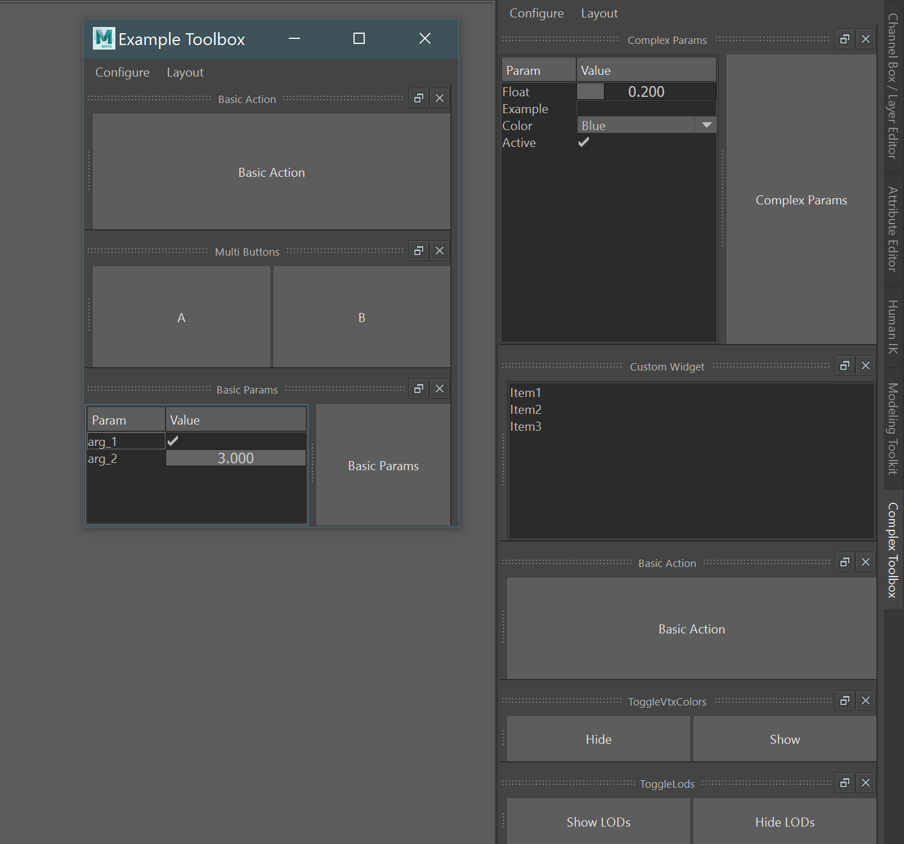

# tool-dock
Customizable UI for quick DCC tool palettes

# How it works
Via the *Configure* button you can specify tools that should be visible in the UI.

Any subclass of ToolDockItemBase can be added as QDockWidgets to the main UI.
In *tool_dock_examples.py* you'll find some samples of how to define tool classes.

Classes with a *run* function defined will be executed on button press.

Classes with a *get_tool_actions* function defined will be added as individual buttons.

# Extra Environment Variables

*TOOL_DOCK_SCRIPT_FOLDERS* defines root folders for extra scripts that will be added as tools.

*TOOL_DOCK_EXTRA_MODULES* defines extra modules to be imported on tool startup. Tools can be defined in these modules, which will then be available in the configurations.  

You can also make a folder or module file that starts with *tool_dock_ext* anywhere in the sys.path and it will automatically be imported on startup. And any classes defined inside will be available. 

# Install

<pre>
1. Download this package and unzip it in a good location 
    1.B (or git clone it directly if you have git installed)
2. Run installer.bat (will walk you through some options for install)
3. Restart Maya
</pre>

# Start the tool
1. Run this script in a python tab in maya

<pre>

import tool_dock
tool_dock.main()

</pre>

